# Kubernetes Container Orchestration

## Overview
This repository contains Kubernetes manifest files to deploy and manage a web application using minikube. It covers fundamental container orchestration concepts, including Namespaces, ConfigMaps, Secrets, Deployments, and Services.

## Technology Stack
*   **Orchestration Engine:** Kubernetes (Minikube)
*   **Application Server:** Nginx
*   **Command Line Tool:** `kubectl`
*   **Configuration:** YAML Manifests

---

## Architecture and Workflow

### 1. Environment Setup
The local cluster is provisioned using Minikube. We start the cluster, verify nodes and pods, and ensure everything is running smoothly.

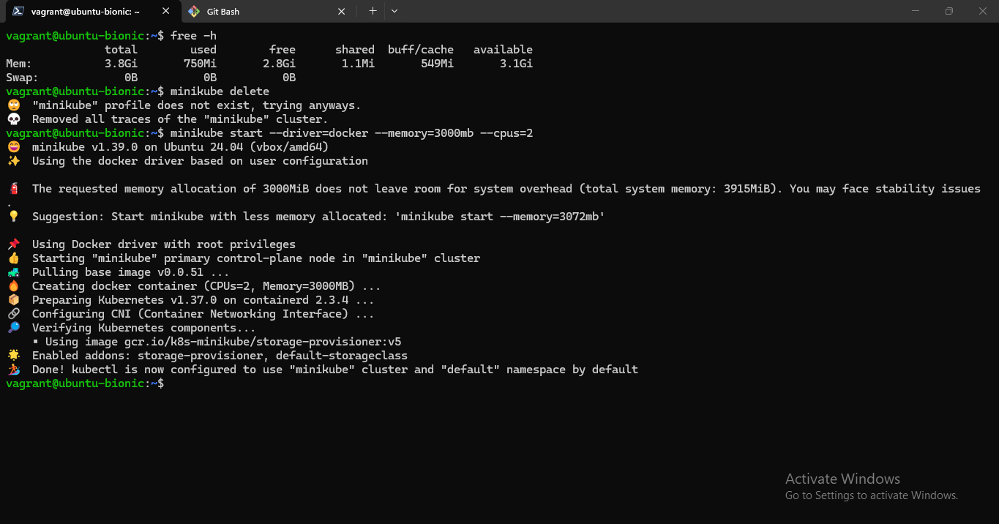
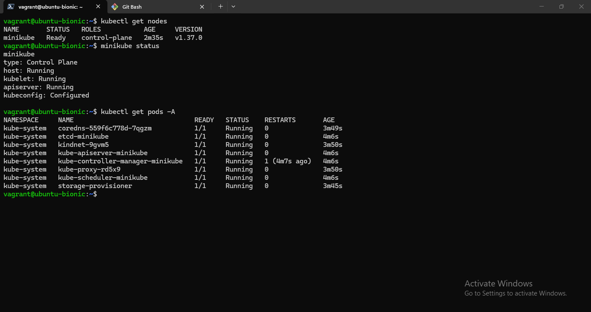

### 2. Kubernetes Objects & Manifests
The application is deployed using declarative YAML manifests. We first create these manifests as code:

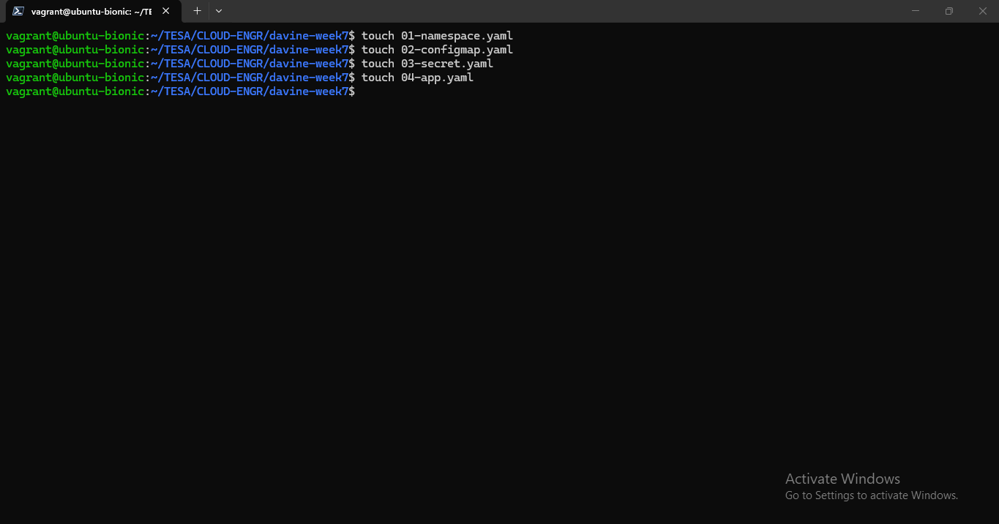

*   **Namespace (`01-namespace.yaml`)**: Creates an isolated environment (`davine-space`) for the deployment.
    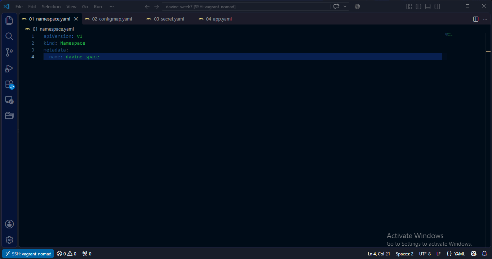
*   **ConfigMap (`02-configmap.yaml`)**: Stores non-confidential configuration data for the web app (e.g., `ENV_MODE`, `APP_VERSION`).
    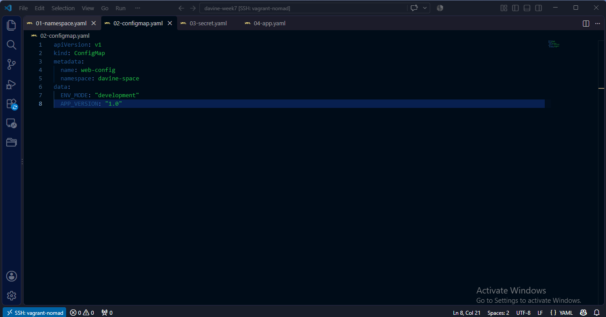
*   **Secret (`03-secret.yaml`)**: Securely stores sensitive data (e.g., `db_password`) as an Opaque secret.
    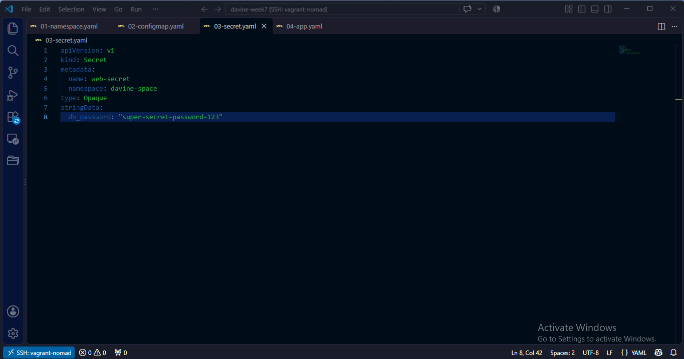
*   **Deployment & Service (`04-app.yaml`)**: Defines a Deployment managing a ReplicaSet (initially 3 replicas) running the Nginx image. It also defines a NodePort Service (`davine-webapp-service`) to expose the application to the external network.
    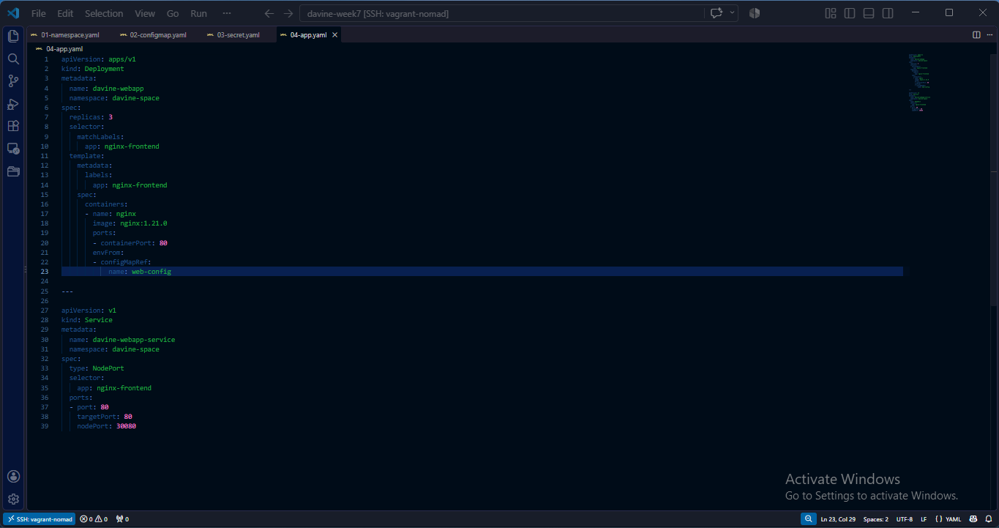

#### Applying Manifests
All configurations are applied using `kubectl apply -f .`

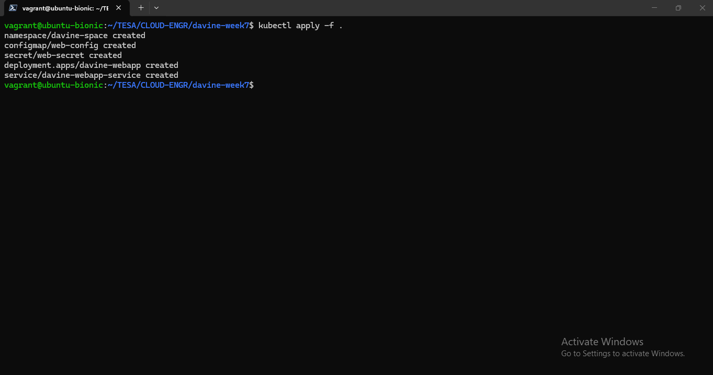

### 3. Verification & Application Access
We can verify the created resources such as deployments, pods, configmaps, and secrets to ensure our environment is correctly built out.

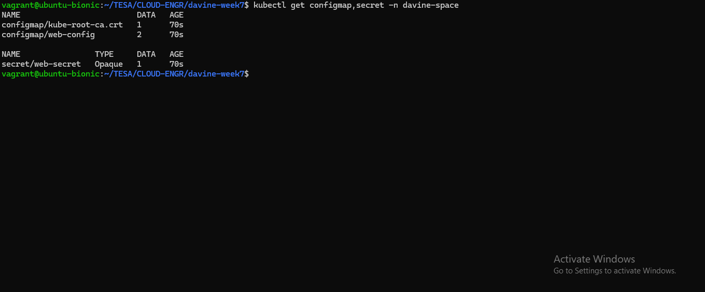
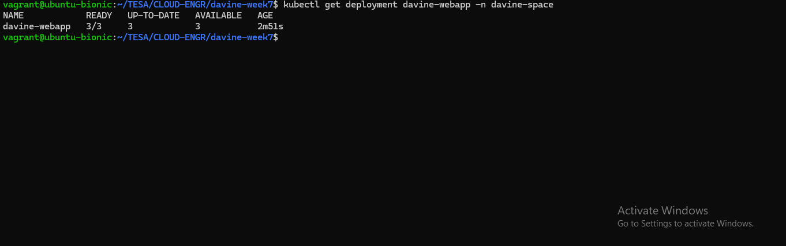
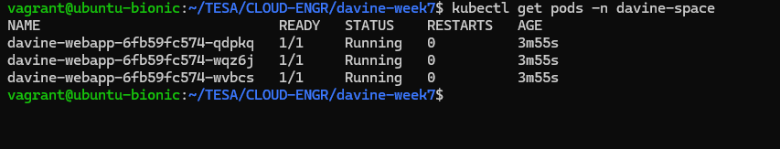
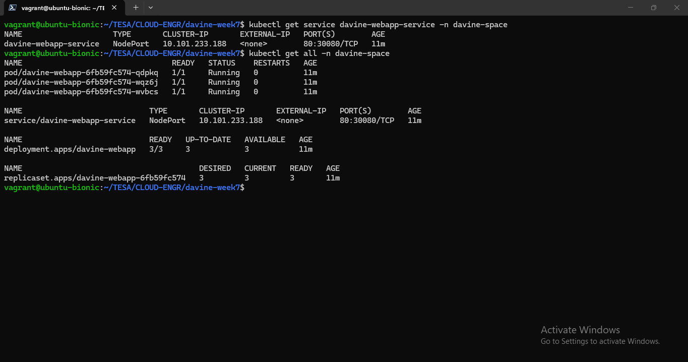

The application is accessible in the browser through the Minikube IP and the exposed NodePort:

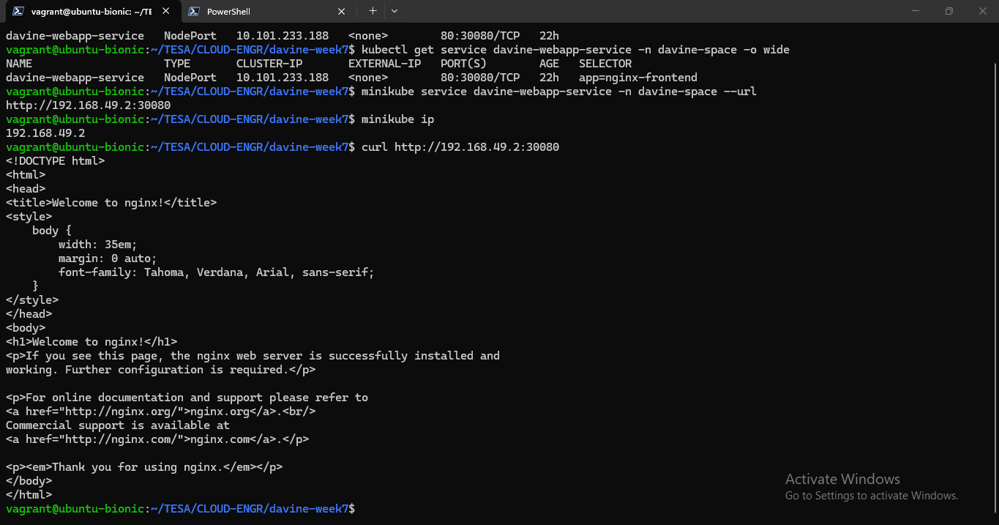
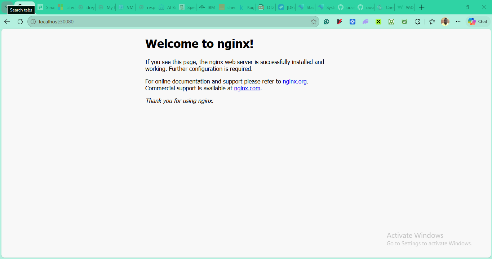

### 4. Managing Deployments
Kubernetes seamlessly manages replicas and rollouts, allowing us to dynamically orchestrate our container environment:

*   **Scale Up**: Scaling the deployment up to 5 replicas to handle more traffic.
    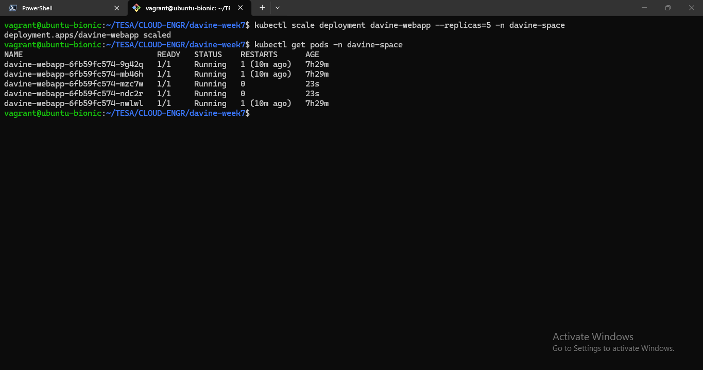
*   **Scale Down**: Safely scaling the deployment down to 3 replicas.
    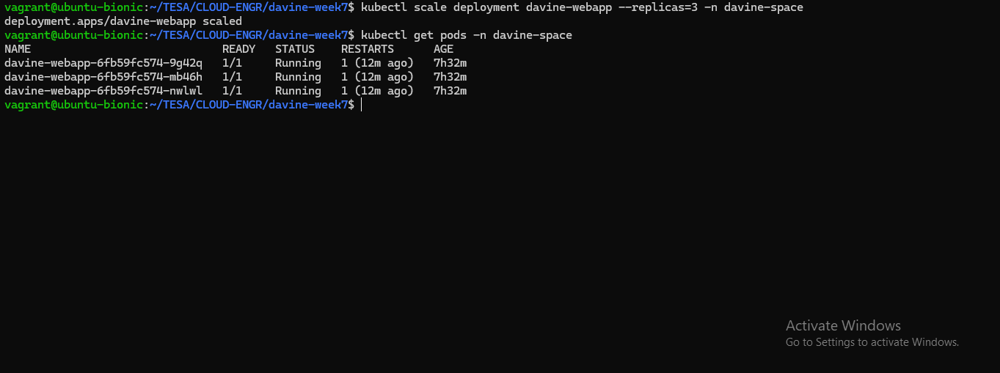
*   **Rolling Updates**: Updating the application image (e.g., switching to `nginx:1.22.0`).
    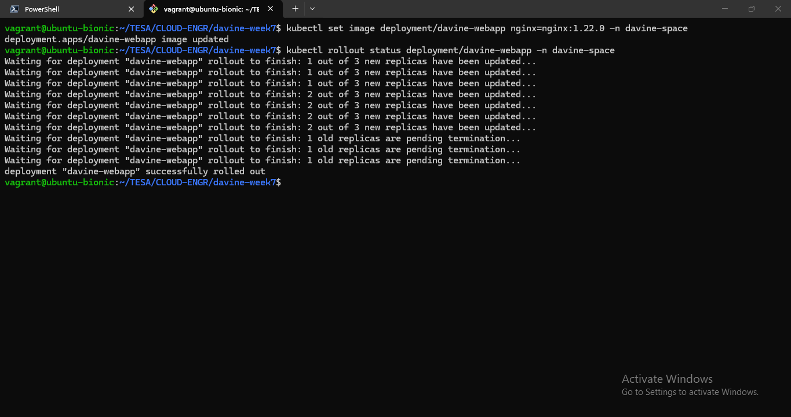
*   **Rollbacks**: Quickly rolling back a deployment if a change causes issues.
    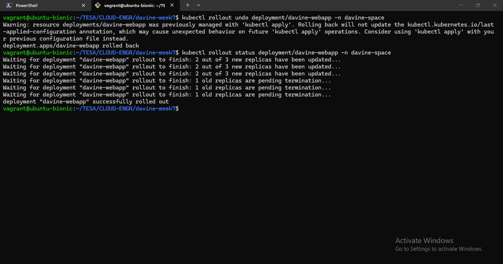

---
**Author:** Oseni Sakariyau Oluwadamilare (Dami)  
**Role:** DevOps Engineering Intern @ Davine Technology

## License

Released under the [MIT License](LICENSE).
